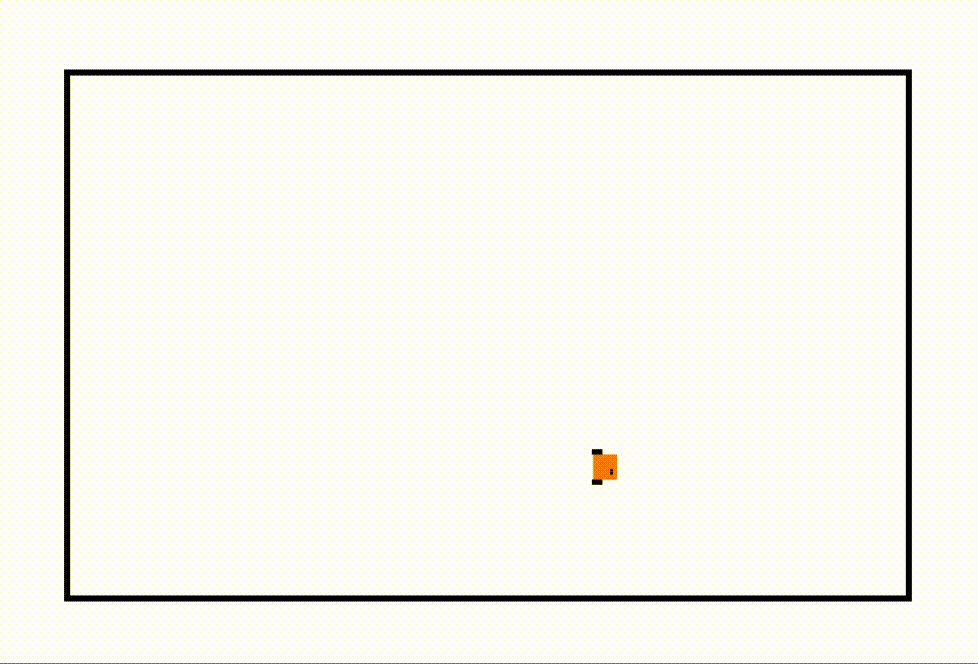

# LiDAR Sim

- A 2D LiDAR visualization for simulated robots in MATLAB at the Georgia Tech Robotarium

- Ability to modify distance, angular resolution, and Gaussian distortion of points

- Soon to work with any N-vertice shape and multiple robots simultaneously

