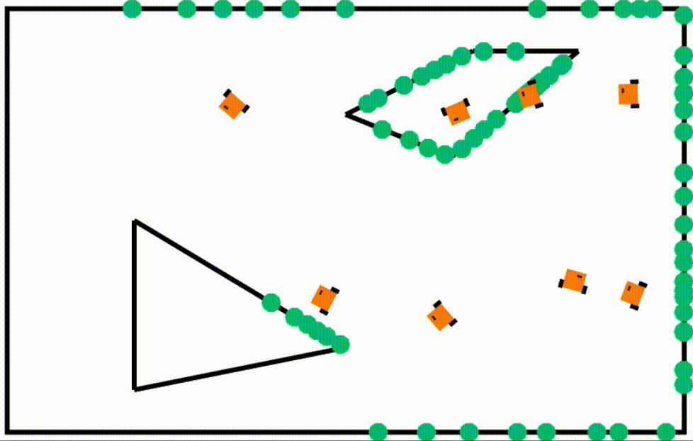

# LiDAR Sim

####:fireworks: A 2D LiDAR visualization for simulated robots in MATLAB at the Georgia Tech Robotarium

#### :wavy_dash: Ability to modify distance, angular resolution, and Gaussian distortion of points

#### :mount_fuji:Works with any N-vertice shape and multiple robots simultaneously

Usage:

`LIDAR(x, N, ang_Res, dist, obs, error)`

- x is the current robot's x,y position
- N is the number of active robots
- ang_Res is how many 360/N rays to be generated
- dist is the maximum distance range of a ray
- obs are predefined obstacles given by its vertices
- error is defined as either 'None' or 'Gaussian'

#

